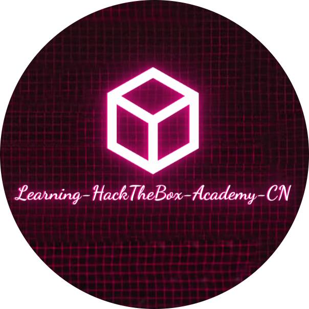
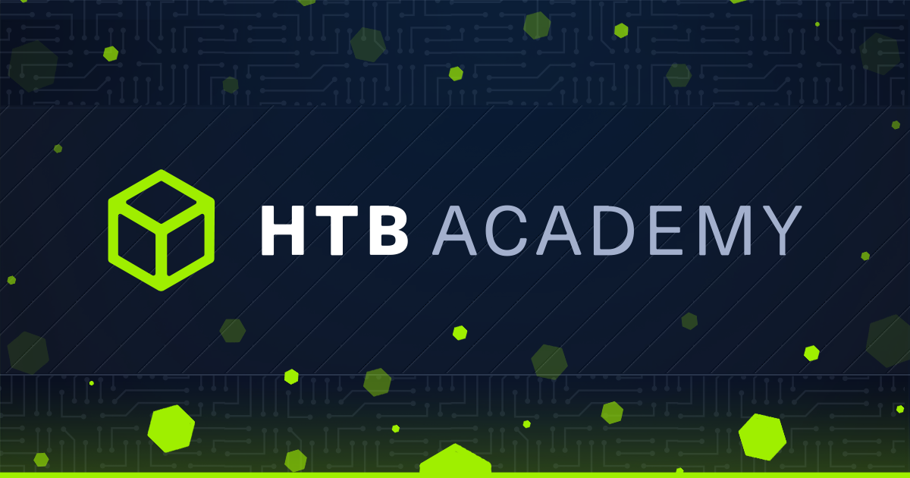

# Welcome

<figure><figcaption></figcaption></figure>

本项目GitHub链接：[https://github.com/Cybersecurity-Self-Learning/Learning-HackTheBox-Academy-CN](https://github.com/Cybersecurity-Self-Learning/Learning-HackTheBox-Academy-CN)

<figure><figcaption></figcaption></figure>

**HackTheBox Academy** 是网络安全领域的 **综合学习平台**，与知名渗透测试平台 HackTheBox 同源，主打 **结构化课程 + 实战演练**，适合系统化提升攻防技能。

#### **核心特点**

1. **模块化课程**：覆盖 Web 安全、渗透测试、逆向工程等领域，分初级到专家级。
2. **互动实验室**：结合理论讲解与在线靶场，提供实时漏洞利用环境。
3. **技能路径**：定制学习路径（如 OSCP 备考、红队专项），配套挑战与认证考试。
4. **社区协作**：支持多人协作解题，集成论坛讨论与进度追踪。

#### **适合人群**

* **新手**：基础课程（如 Linux、网络原理） + 引导式实验。
* **进阶者**：Active Directory 攻击、二进制分析等高级模块。

**访问链接**：[HackTheBox Academy官网](https://academy.hackthebox.com/)（部分内容免费，高级课程需订阅）。

**总结**：以实战驱动学习，体系完整，适合从零构建系统化安全技能。
